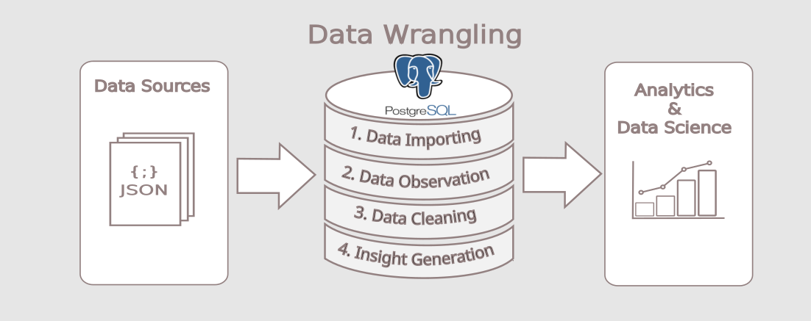
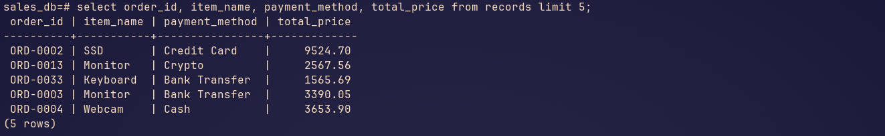

# Postgresql_Data_Wrangling

# *Overview*
Project repo to demonstrate Data Wrangling in PostgreSQL, process start with importing Data Source JSON file into PostgreSQL, Data Observation using Jupyterlab by checking duplication, missing value, inconsistent data type. Data Cleaning refer to Data Observation & Finally Generate Business Insight for Data Analytics or Data Science.
# *Prererquisites*
To follow along this project neeb to be available on your system:
- Python3 with psycopgy2, jupyterlab
  ```bash
  sudo apt install python3

  pip install psycopg2, jupyterlab
  ```
- PostgreSQL running on system
  ```bash
  sudo systemctl status postgresql
  ```
- Vim installed (optional)
  ```bash
  sudo apt install vim
  ```
# *Project Flow*
1. Import necessary library
   ```python3
   import psycopg2
   from psycopg2 import extras
   ```
2. Create postgreSQL connection
   ```python3
   conn = psycopg2.connect(
            dbname=DB_NAME,
            user=DB_USER,
            password=DB_PASSWORD,
            host=DB_HOST,
            port=DB_PORT
        )
   cur = conn.cursor()
   ```
3. Import JSON file into postgresql
   ```python3
   # Insert the record into the database
    cur.execute(insert_sql, record_values)
   ....
   # Commit the changes and close the connection
   conn.commit()
   ```
   
4. Data observation
   ```python3
   import pandas as pd

   columns = [desc[0] for desc in cur.description]
   df = pd.DataFrame(data, columns = columns)
   df.head()
   .....
   # Checking duplicate value
   cur.execute(duplicate_order_id)
   duplicates = cur.fetchall()
   if duplicates:
        print("Duplicate order_id found")
   else:
       print("No duplicate found on order_id")
   # Checking null value
   def check_for_none(cursor, table_name, column_name):
       query = f"SELECT * FROM {table_name} WHERE {column_name} IS NULL;"
       print(f"Executing {query}")
       cursor.execute(query)
       result = cursor.fetchall()
       if result:
          print(f"Found NULL on {column_name}")
       else:
          print(f"Not found NULL on {column_name}")
   ```
5. Data cleaning
   ```python3
   # Fillin Null value age with median value
   median_age = ''' UPDATE records SET customer_age =(
                SELECT percentile_cont(0.5) WITHIN GROUP (ORDER BY customer_age)
                FROM records)
                WHERE customer_age IS NULL;
            '''
   cur.execute(median_age)
   # Commit the changes and close the connection
   conn.commit()

   # Update payment_method with Cash
   payment_method = ''' UPDATE records SET payment_method = 'Cash'
                    WHERE payment_method IS NULL;
                '''
   cur.execute(payment_method)
   # Commit the changes and close the connection
   conn.commit()

   # Update notes column rename to special_handling
   special_handling = ''' ALTER TABLE records RENAME COLUMN notes TO special_handling;
                '''
   cur.execute(special_handling)
   # Commit the changes and close the connection
   conn.commit()
   ```
6. Generate Business Insight
   ```python3
   # Best Selling Item
   best_selling_item = ''' SELECT item_name, sum(total_price) FROM records
                        GROUP BY item_name ORDER BY sum(total_price) DESC LIMIT 5;
                    '''
   cur.execute(best_selling_item)
   best_selling_item_result = cur.fetchall()
   best_selling_item_result
   
   # Sales Distribution By Age
   sale_distribution_age = '''
    SELECT
        CASE
            WHEN customer_age IS NULL THEN 'Other/Unknown'
            WHEN (customer_age)::INT >= 0 AND (customer_age)::INT < 18 THEN '0-17'
            WHEN (customer_age)::INT >= 18 AND (customer_age)::INT < 25 THEN '18-24'
            WHEN (customer_age)::INT >= 25 AND (customer_age)::INT < 35 THEN '25-34'
            WHEN (customer_age)::INT >= 35 AND (customer_age)::INT < 50 THEN '35-49'
            WHEN (customer_age)::INT >= 50 AND (customer_age)::INT < 65 THEN '50-64'
            WHEN (customer_age)::INT >= 65 AND (customer_age)::INT < 100 THEN '65-99'
            ELSE 'Other/Unknown'
        END AS age_group,
        COUNT(*) AS total_price
    FROM
        records
    GROUP BY
        age_group
    ORDER BY
        age_group;
    '''
   cur.execute(sale_distribution_age)
   sale_distribution_age_result = cur.fetchall()
   sale_distribution_age_result
   
   # Sales Distribution By Region
   sales_by_region = ''' SELECT region, sum(total_price) FROM records
                    GROUP BY region ORDER BY sum(total_price) DESC;
                '''
   cur.execute(sales_by_region)
   sales_by_region_result = cur.fetchall()
   sales_by_region_result
   
   # Status Status Breakdown
   status_query = ''' SELECT status, SUM(total_price) FROM records
                GROUP BY status ORDER BY SUM(total_price) DESC;
            '''
   cur.execute(status_query)
   status_query_result = cur.fetchall()
   status_query_result
   
   ```
7. CLose connindtion
   ```python3
   # Close cursor
   cur.close()
   # Close connection
   conn.close()
   ```
